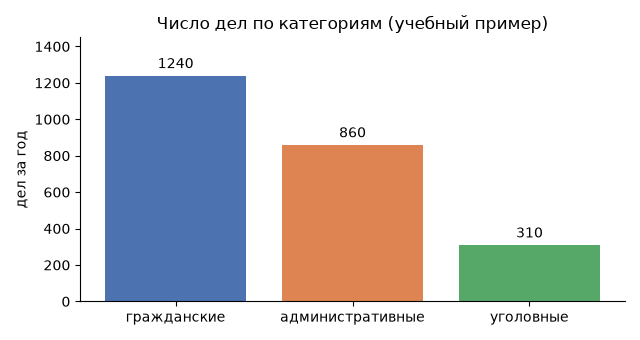

# Руководство по оформлению Markdown-файлов

Markdown — это облегчённый язык разметки: вы пишете обычный текст со служебными символами, а GitHub или Jupyter показывают его оформленным. В курсе Markdown нужен в двух местах: в файлах `.md` репозитория и в текстовых ячейках ноутбуков. Почти всё работает одинаково, отличия собраны в [последнем разделе](#markdown-в-jupyter-и-на-github-отличия).

Каждый элемент ниже показан дважды: сначала исходник, затем результат.

## Заголовки
```
# Заголовок первого уровня
## Заголовок второго уровня
### Заголовок третьего уровня
#### Заголовок четвёртого уровня
##### Заголовок пятого уровня
###### Заголовок шестого уровня
```
***Пример:***

# Заголовок первого уровня
## Заголовок второго уровня
### Заголовок третьего уровня
#### Заголовок четвёртого уровня
##### Заголовок пятого уровня
###### Заголовок шестого уровня
---

## Параграфы и переносы строк
```
Это параграф. Чтобы создать новый параграф, оставьте пустую строку между двумя строками текста.

Это первая строка  
И это вторая строка, но они находятся в одном параграфе. Для переноса строки используйте два пробела в конце предыдущей строки.
```
***Пример:***

Это параграф. Чтобы создать новый параграф, оставьте пустую строку между двумя строками текста.

Это первая строка  
И это вторая строка, но они находятся в одном параграфе. Для переноса строки используйте два пробела в конце предыдущей строки.

---

## Выделение текста
```
*курсив*  
_курсив_

**жирный**  
__жирный__

***жирный курсив***  
___жирный курсив___

~~зачёркнутый~~
```
***Пример:***

*курсив*  
_курсив_

**жирный**  
__жирный__

***жирный курсив***  
___жирный курсив___

~~зачёркнутый~~

---

## Экранирование
Если служебный символ нужен как обычный текст, поставьте перед ним обратную косую черту `\`.
```
\*это не курсив\*, сумма иска \$100, символ решётки \# в начале строки
```
***Пример:***

\*это не курсив\*, сумма иска \$100, символ решётки \# в начале строки

---

## Списки
### Нумерованный список
```
1. Пункт первый
2. Пункт второй
3. Пункт третий
```
***Пример:***

1. Пункт первый
2. Пункт второй
3. Пункт третий
---

### Маркированный список
```
- Пункт первый
- Пункт второй
- Пункт третий
```
***Пример:***

- Пункт первый
- Пункт второй
- Пункт третий

Для разметки маркированных списков можно использовать `*`, или `-`, или `+`.

---
### Вложенные списки
Также можно делать вложенные списки, добавляя 4 пробела перед пунктом:
```
1. Пункт первый
    - Подпункт первый
    - Подпункт второй
2. Пункт второй
```
***Пример:***

1. Пункт первый
    - Подпункт первый
    - Подпункт второй
2. Пункт второй
---

## Ссылки
```
[Текст ссылки](https://www.example.com)
```
***Пример:***

[Текст ссылки](https://www.example.com)

---

## Изображения
Путь к картинке указывается относительно файла, в котором вы пишете. Для картинки из интернета укажите полный адрес.
```

```
***Пример:***


---

## Блоки кода
### Строка кода
```
`строка кода`
```
***Пример:***

`строка кода`

---
### Блок кода
Блок кода начинается и заканчивается строкой из трёх обратных кавычек:
````
```
Блок кода
```
````
***Пример:***

```
Блок кода
```

Если внутри блока нужно показать сами тройные кавычки, как в этом справочнике, оформите внешний блок четырьмя кавычками.

---
### Подсветка кода
Для блоков кода можно указывать язык программирования: после открывающих кавычек напишите `python`, `bash`, `sql`, `json` и т. д.

````
```python
print("Привет, мир!")
```
````
***Пример:***

```python
print("Привет, мир!")
```

---

## Формулы
Формулы записываются в нотации LaTeX. Внутри строки формула ставится между одинарными знаками `$`, отдельной строкой — между двойными `$$`.
```
Среднее $\bar{x} = \frac{1}{n}\sum_{i=1}^{n} x_i$ считается по всей выборке.

$$
s = \sqrt{\frac{1}{n-1}\sum_{i=1}^{n}(x_i - \bar{x})^2}
$$
```
***Пример:***

Среднее $\bar{x} = \frac{1}{n}\sum_{i=1}^{n} x_i$ считается по всей выборке.

$$
s = \sqrt{\frac{1}{n-1}\sum_{i=1}^{n}(x_i - \bar{x})^2}
$$

Команды, которые понадобятся чаще всего:

| Что | Как записать | Результат |
|---|---|---|
| индекс и степень | `x_i`, `x^2`, `x_{ij}` | $x_i$, $x^2$, $x_{ij}$ |
| дробь | `\frac{a}{b}` | $\frac{a}{b}$ |
| корень | `\sqrt{x}` | $\sqrt{x}$ |
| сумма | `\sum_{i=1}^{n} x_i` | $\sum_{i=1}^{n} x_i$ |
| среднее, оценка | `\bar{x}`, `\hat{p}` | $\bar{x}$, $\hat{p}$ |
| греческие буквы | `\alpha`, `\mu`, `\sigma` | $\alpha$, $\mu$, $\sigma$ |
| сравнения | `\le`, `\ge`, `\ne`, `\approx` | $\le$, $\ge$, $\ne$, $\approx$ |

Знак доллара в обычном тексте экранируйте: `\$100`, иначе он будет прочитан как начало формулы.

---

## Цитаты
```
> Первый уровень цитирования
>> Второй уровень цитирования
>>> Третий уровень цитирования
```
***Пример:***

> Первый уровень цитирования
>> Второй уровень цитирования
>>> Третий уровень цитирования

---

## Горизонтальная линия
```
---
```
***Пример:***

---

---

## Таблицы
```
| Заголовок 1 | Заголовок 2 |
| ----------- | ----------- |
| Ячейка 1    | Ячейка 2   |
| Ячейка 3    | Ячейка 4   |
```
***Пример:***

| Заголовок 1 | Заголовок 2 |
| ----------- | ----------- |
| Ячейка 1    | Ячейка 2   |
| Ячейка 3    | Ячейка 4   |


Можно управлять выравниванием столбцов при помощи двоеточия.
```
| Left-Aligned  | Center Aligned  | Right Aligned |
|:------------- |:---------------:| -------------:|
| col 3 is      | some wordy text |     **$1600** |
| col 2 is      | centered        |         $12   |
| zebra stripes | are neat        |        ~~$1~~ |
```
***Пример:***

| Left-Aligned  | Center Aligned  | Right Aligned |
|:------------- |:---------------:| -------------:|
| col 3 is      | some wordy text |     **$1600** |
| col 2 is      | centered        |         $12   |
| zebra stripes | are neat        |        ~~$1~~ |

Внутри таблиц можно использовать ссылки, наклонный, жирный или зачёркнутый текст.


---

### Таблица как HTML
```
<table>
    <tr>
        <th>Заголовок 1</th>
        <th>Заголовок 2</th>
    </tr>
    <tr>
        <td>Ячейка 1.1</td>
        <td>Ячейка 2.1</td>
    </tr>
    <tr>
        <td>Ячейка 1.2</td>
        <td>Ячейка 2.2</td>
    </tr>
</table>
```
***Пример:***

<table>
    <tr>
        <th>Заголовок 1</th>
        <th>Заголовок 2</th>
    </tr>
    <tr>
        <td>Ячейка 1.1</td>
        <td>Ячейка 2.1</td>
    </tr>
    <tr>
        <td>Ячейка 1.2</td>
        <td>Ячейка 2.2</td>
    </tr>
</table>

---

## Чек-листы
```
- [x] Задача 1
- [ ] Задача 2
- [ ] Задача 3
```
***Пример:***

- [x] Задача 1
- [ ] Задача 2
- [ ] Задача 3

На GitHub галочки можно переключать мышью, в Jupyter они только отображаются.

---

## Ссылки внутри документа
Каждый заголовок автоматически получает якорь: текст заголовка, в котором пробелы заменены дефисами, а знаки препинания убраны. Ссылка на якорь начинается с `#`.
```
[Перейти к таблицам](#таблицы)  
[Перейти к блокам кода](#блоки-кода)
```
***Пример:***

[Перейти к таблицам](#таблицы)  
[Перейти к блокам кода](#блоки-кода)

GitHub переводит якорь в строчные буквы (`#таблицы`), а Jupyter сохраняет регистр заголовка (`#Таблицы`). Если ссылка должна работать и там, и там, или вести не на заголовок, поставьте свой якорь через HTML-тег и ссылайтесь на него:
```
[Перейти к примеру якоря](#anchor-example)

## <a id="anchor-example">Пример якоря</a>
Какой-то контент
```
***Пример:***

[Перейти к примеру якоря](#anchor-example)

## <a id="anchor-example">Пример якоря</a>
Какой-то контент

---

## Автоматические ссылки
```
<http://example.com/>

<address@example.com>
```
***Пример***

<http://example.com/>

<address@example.com>

---

## HTML
Внутри Markdown можно использовать HTML-теги. Вот те, что работают и на GitHub, и в Jupyter:
```
Нажмите <kbd>Ctrl</kbd> + <kbd>S</kbd>, чтобы сохранить.

H<sub>2</sub>O, x<sup>2</sup>

<details>
<summary>Показать решение</summary>

Этот текст скрыт, пока читатель не нажмёт на заголовок. Внутри работает обычный Markdown, если оставить пустые строки до и после текста.

</details>
```
***Пример:***

Нажмите <kbd>Ctrl</kbd> + <kbd>S</kbd>, чтобы сохранить.

H<sub>2</sub>O, x<sup>2</sup>

<details>
<summary>Показать решение</summary>

Этот текст скрыт, пока читатель не нажмёт на заголовок. Внутри работает обычный Markdown, если оставить пустые строки до и после текста.

</details>

Оформление через тег `<style>` не работает: GitHub и Jupyter вырезают его из соображений безопасности.

---

## HTML-коды
Например, вы можете использовать HTML-код `&macr;` для добавления черты над буквой:
```
A&macr;
```
***Пример:***

A&macr;

---

## Комментарии
Вы можете вставить комментарии в свой markdown-файл, которые не будут отображаться в окончательном отформатированном виде:
```
[//]: # (Это комментарий, он не будет отображаться)
```
***Пример:***

[//]: # (Это комментарий, он не будет отображаться)

---

## Эмодзи (GitHub)
На GitHub можно использовать текстовые коды эмодзи. [Существует множество эмодзи](https://gist.github.com/rxaviers/7360908), вот некоторые из них:
```
:smile:
:laughing:
:blush:
```
***Пример:***

:smile:
:laughing:
:blush:

В Jupyter такие коды не работают: вставляйте сам символ, например 🙂 или ✅.

---

## Markdown в Jupyter и на GitHub: отличия

| Элемент | GitHub (файлы `.md`) | Jupyter (ячейка Markdown) |
|---|---|---|
| Заголовки, списки, таблицы, цитаты, блоки кода | да | да |
| Формулы `$…$` и `$$…$$` | да | да |
| Якорь заголовка | строчные буквы: `#таблицы` | с сохранением регистра: `#Таблицы` |
| Чек-листы | переключаются мышью | только отображаются |
| Эмодзи-коды `:smile:` | да | нет, вставляйте сам символ |
| Теги `<kbd>`, `<sub>`, `<sup>`, `<details>` | да | да |
| Тег `<style>` | вырезается | вырезается |
| Атрибут `style="…"` у тегов | вырезается | работает для основных свойств: цвет, фон, отступы |
| Комментарии `[//]: #` | да | да |
